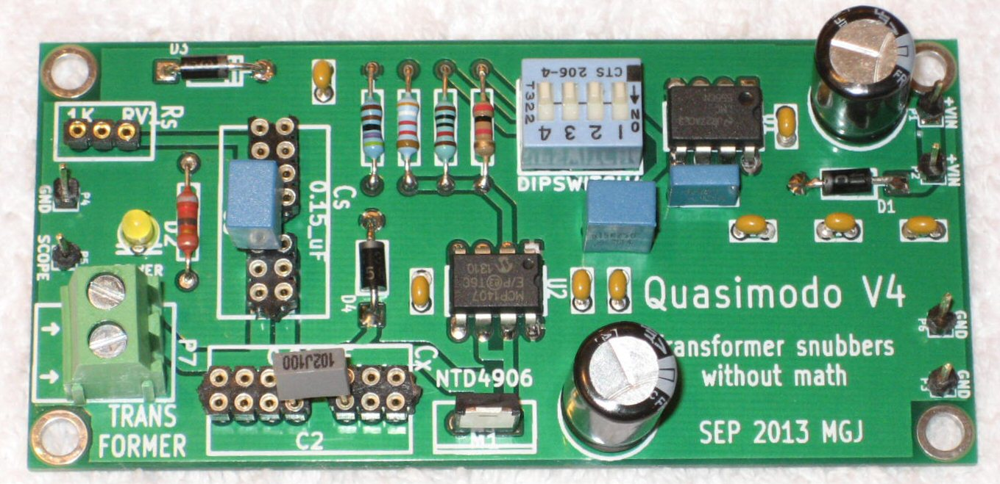
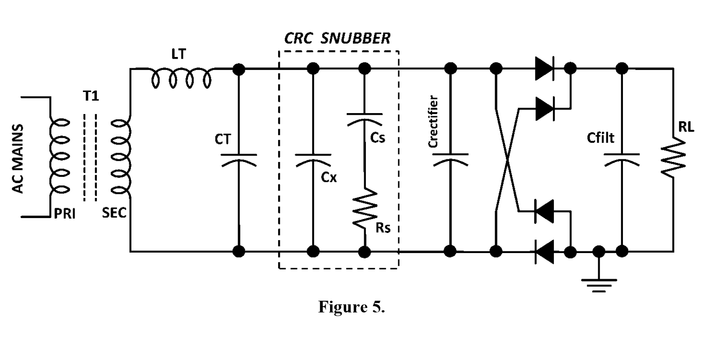

# Transformer-Snubber
very effective transformer secondary snubber - without "Rectifier snubbing", the widespread (inaccurate) use of capacitors across the rectifier diodes  

----

Please read the doc:  
"<a href="docs/Quasimodo_jig_revA.pdf">Simple, No-Math Transformer Snubber using “Quasimodo” Test Jig.pdf</a>" by <a href="https://linearaudio.net/authors/436">Mark Johnson</a>  
  
That's what this repo is about:  
Construction of a test jig to determine the correct values for a CRC\* snubber, which fits individually to the measured transformer type, so that no overshoot (=ringing / noise) occurs.  
  

----

\*here we use a three element "CRC" snubber on the secondary side of the transformer  
and the exact values for Cx, Rs and Cs (individually for each transformer type) are determined with our "Quasimodo" test jig and an oscilloscope.  
  
  
----

see as well this excellent article by <a href="https://linearaudio.net/authors/436">Mark Johnson</a> about the basics and backgrounds of this topic   
"<a href="docs/related/Soft Recovery Diodes Lower Transformer Ringing by 10-20X.pdf">Soft Recovery Diodes Lower Transformer Ringing by 10-20X.pdf</a>"

----

here is also a mathematical approach from TI   
(but for switched-mode power supplies. However, it can also be used for 50/60 Hz applications)  
https://e2e.ti.com/blogs_/b/powerhouse/posts/calculate-an-r-c-snubber-in-seven-steps  
Backup here: <a href="docs/related/Power Tips Calculate an R-C snubber in seven steps.pdf">docs/related/Power Tips Calculate an R-C snubber in seven steps.pdf</a>
